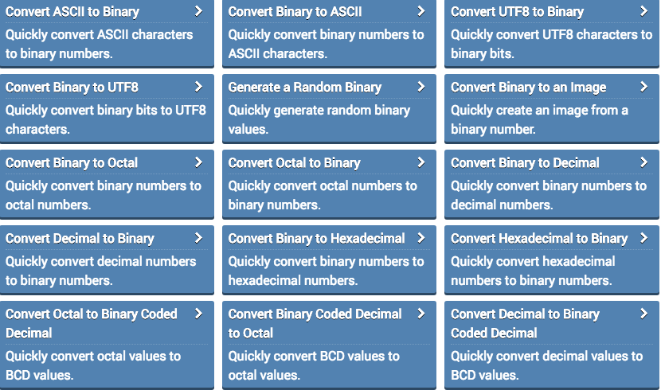
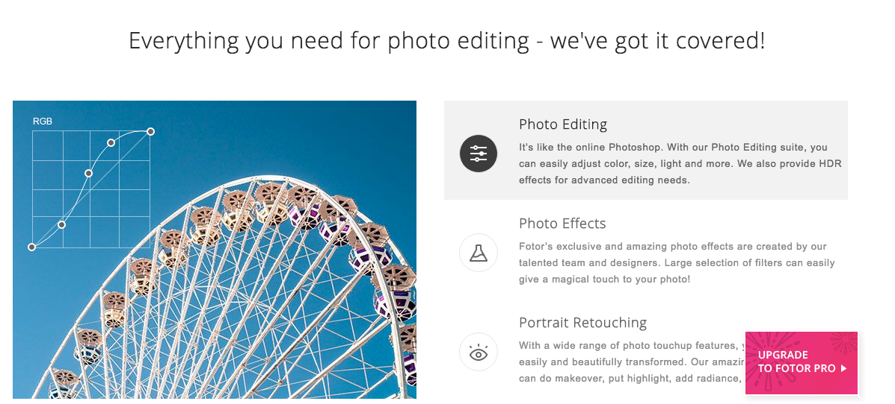

#Tools

Here you can find useful tools for regular computer programming related tasks.

- #### ***Online Binary Tool***

  [Online Binary Tool](https://onlinebinarytools.com/)  You can find useful tools for binary operations.

  

- #### ***ReLaXed***

  [ReLaXed](https://github.com/RelaxedJS/ReLaXed) Create PDF documents using web technologies

  

- [CSVKit](https://csvkit.readthedocs.io/en/1.0.3/?utm_campaign=CodeTengu&utm_medium=email&utm_source=CodeTengu_124)

  csvkit is a suite of command-line tools for converting to and working with CSV, the king of tabular file formats.

- [Online Photo Editor](https://www.fotor.com/)

  It's online revolutionary photo editor.

  

- [Stenci-Open Source Office Suites](https://stenci.la/)

  # An open source office suite for reproducible research

  The calls for research to be transparent and reproducible have never been louder. But today's tools for reproducible research can be intimidating - especially if you're not a coder. Stencila makes reproducible research more accessible with the intuitive word processor and spreadsheet interfaces that you and your colleagues are already used to.

- [Online Screen Recorder](https://showmore.com/)

  ShowMore, Record video with difference with PowerSoft online tools.